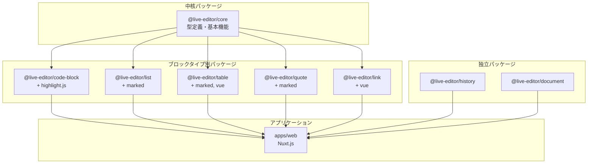

# アーキテクチャドキュメント

## 概要

live-editor プロジェクトは pnpm ワークスペースを使用したモノレポとして設計されており、複数のパッケージ間で効率的なコード共有と統一された依存関係管理を可能にしています。メインアプリケーションは Nuxt.js と Vue 3 で構築されたブロックベースの Markdown エディタです。

## モノレポ構成

```
live-editor/
├── .github/
│   └── workflows/
│       └── ci.yml                # GitHub Actions CI パイプライン
├── apps/
│   └── web/                      # Nuxt.js Web アプリケーション
│       ├── components/           # Vue コンポーネント
│       │   └── MarkdownEditor.vue
│       ├── pages/                # Nuxt ページ
│       ├── server/               # サーバー API ルート
│       │   └── api/
│       │       └── fetch-title.ts  # OGP メタデータ取得
│       └── public/               # 静的アセット
├── packages/
│   ├── core/                     # 型定義・基本機能（中核）
│   │   ├── src/
│   │   │   ├── composables/      # 基本 Composables
│   │   │   │   ├── useMarkdownBlocks.ts
│   │   │   │   ├── useMarkdownRenderer.ts
│   │   │   │   ├── useBlockEditor.ts
│   │   │   │   ├── useKeyboardHandler.ts
│   │   │   │   └── useFormatToolbar.ts
│   │   │   ├── types/            # 型定義
│   │   │   └── index.ts
│   │   └── README.md
│   ├── code-block/               # コードブロック
│   │   ├── src/
│   │   │   ├── useHighlight.ts
│   │   │   ├── useCodeBlockRenderer.ts
│   │   │   └── index.ts
│   │   └── README.md
│   ├── list/                     # リスト・チェックリスト
│   │   ├── src/
│   │   │   ├── useChecklistRenderer.ts
│   │   │   ├── useListRenderer.ts
│   │   │   └── index.ts
│   │   └── README.md
│   ├── table/                    # テーブル
│   │   ├── src/
│   │   │   ├── useTableGenerator.ts
│   │   │   ├── useTableCommand.ts
│   │   │   ├── useTableRenderer.ts
│   │   │   └── index.ts
│   │   └── README.md
│   ├── quote/                    # 引用
│   │   ├── src/
│   │   │   ├── useQuoteRenderer.ts
│   │   │   └── index.ts
│   │   └── README.md
│   ├── link/                     # リンクプレビュー
│   │   ├── src/
│   │   │   ├── useLinkPreview.ts
│   │   │   ├── useLinkPreviewRenderer.ts
│   │   │   └── index.ts
│   │   └── README.md
│   ├── history/                  # Undo/Redo 履歴管理
│   │   ├── src/
│   │   │   ├── useEditorHistory.ts
│   │   │   └── index.ts
│   │   └── README.md
│   └── document/                 # ドキュメント操作
│       ├── src/
│       │   ├── useMarkdownDocument.ts
│       │   └── index.ts
│       └── README.md
├── docs/
│   ├── ARCHITECTURE.md           # このファイル
│   ├── GLOSSARY.md               # ユビキタス言語定義
│   └── QUICKSTART.md             # クイックスタートガイド
├── package.json                  # ルートパッケージ設定
├── pnpm-workspace.yaml           # ワークスペース定義
├── eslint.config.js              # ESLint 設定
├── prettier.config.js            # Prettier 設定
├── tsconfig.json                 # TypeScript ベース設定
├── CONTRIBUTING.md               # 開発ガイドライン
└── README.md                     # プロジェクト概要
```

## パッケージアーキテクチャ

### apps/web（Nuxt.js アプリケーション）

**目的**: リアルタイムプレビュー付きブロックベース Markdown エディタ

メインアプリケーションは Nuxt.js 4 で構築され、Vue 3 の Composition API パターンに従っています。ビジネスロジックは保守性とテスト容易性のために Composables に分離されています。

### パッケージ依存関係図



### Composables アーキテクチャ

```
┌─────────────────────────────────────────────────────────────────┐
│                    MarkdownEditor.vue                            │
│                    （メインコンポーネント）                          │
└─────────────────────────────────────────────────────────────────┘
                              │
        ┌─────────────────────┼─────────────────────┐
        │                     │                     │
        ▼                     ▼                     ▼
┌───────────────┐   ┌─────────────────┐   ┌─────────────────┐
│useMarkdownBlocks│   │useBlockEditor   │   │useMarkdownDocument│
│ - コンテンツ解析 │   │ - 編集状態     │   │ - 読み込み/保存  │
│ - ブロックタイプ │   │ - ドラッグ&ドロップ│   │ - クリップボード │
│ (@live-editor/  │   │ (@live-editor/  │   │ (@live-editor/   │
│  core)          │   │  core)          │   │  document)       │
└───────────────┘   └─────────────────┘   └─────────────────┘
        │                     │
        ▼                     ▼
┌───────────────┐   ┌─────────────────┐   ┌─────────────────┐
│useMarkdownRenderer│ │useKeyboardHandler│ │useEditorHistory │
│ - HTML 出力    │   │ - ショートカット │   │ - Undo/Redo     │
│ - リンクプレビュー│   │ - ナビゲーション │   │ - 状態追跡      │
│ (@live-editor/  │   │ (@live-editor/  │   │ (@live-editor/   │
│  core)          │   │  core)          │   │  history)        │
└───────────────┘   └─────────────────┘   └─────────────────┘
        │                     │
        ▼                     ▼
┌───────────────┐   ┌─────────────────┐   ┌─────────────────┐
│useLinkPreview │   │useFormatToolbar │   │useTableGenerator│
│ - OGP 取得    │   │ - 太字, 斜体    │   │ - /table コマンド│
│ - プレビューカード│   │ - 見出し       │   │ - テーブルマークアップ│
│ (@live-editor/  │   │ (@live-editor/  │   │ (@live-editor/   │
│  link)          │   │  core)          │   │  table)          │
└───────────────┘   └─────────────────┘   └─────────────────┘
        │
        ▼
┌───────────────┐
│useHighlight   │
│ - 構文カラー   │
│ (@live-editor/ │
│  code-block)   │
└───────────────┘
```

### パッケージ詳細

| パッケージ                | 目的                       | 主なエクスポート                                                                                                             |
| ------------------------- | -------------------------- | ---------------------------------------------------------------------------------------------------------------------------- |
| `@live-editor/core`       | 型定義・基本 Composables   | `useMarkdownBlocks`, `useBlockEditor`, `useKeyboardHandler`, `useFormatToolbar`, `useMarkdownRenderer`, `Block`, `BlockType` |
| `@live-editor/code-block` | コードブロックハイライト   | `useHighlight`, `useCodeBlockRenderer`                                                                                       |
| `@live-editor/list`       | リスト・チェックリスト     | `useChecklistRenderer`, `useListRenderer`                                                                                    |
| `@live-editor/table`      | テーブル生成・レンダリング | `useTableGenerator`, `useTableCommand`, `useTableRenderer`                                                                   |
| `@live-editor/quote`      | 引用ブロック               | `useQuoteRenderer`                                                                                                           |
| `@live-editor/link`       | リンクプレビュー（OGP）    | `useLinkPreview`, `useLinkPreviewRenderer`                                                                                   |
| `@live-editor/history`    | Undo/Redo 履歴管理         | `useEditorHistory`                                                                                                           |
| `@live-editor/document`   | ドキュメント操作           | `useMarkdownDocument`                                                                                                        |

### データフロー

```
┌─────────────────────────────────────────────────────────────────┐
│                      ユーザー入力                                 │
│              （タイピング、クリック、キーボード）                    │
└─────────────────────────────────────────────────────────────────┘
                              │
                              ▼
┌─────────────────────────────────────────────────────────────────┐
│                    useBlockEditor                                │
│              ユーザーインタラクションを処理                         │
│         コンテンツ更新、編集状態を管理                             │
└─────────────────────────────────────────────────────────────────┘
                              │
                              ▼
┌─────────────────────────────────────────────────────────────────┐
│                   useMarkdownBlocks                              │
│              コンテンツをブロックに解析                            │
│         ブロックタイプを決定（見出し、コード、リストなど）           │
└─────────────────────────────────────────────────────────────────┘
                              │
                              ▼
┌─────────────────────────────────────────────────────────────────┐
│                  useMarkdownRenderer                             │
│                ブロックを HTML にレンダリング                      │
│      構文ハイライト適用、プレビューカード作成                       │
└─────────────────────────────────────────────────────────────────┘
                              │
                              ▼
┌─────────────────────────────────────────────────────────────────┐
│                    Vue テンプレート                               │
│              レンダリングされたコンテンツを表示                     │
│         textarea オーバーレイでインタラクティブ編集                 │
└─────────────────────────────────────────────────────────────────┘
```

### サーバー API

アプリケーションには OGP メタデータ取得用のサーバーサイド API が含まれています：

**`/api/fetch-title`** - 指定された URL の OGP メタデータを取得

```typescript
// リクエスト
GET / api / fetch - title
  ? (url = https) //example.com
  : // レスポンス
    {
      title: 'Example Domain',
      description: 'This domain is for use in examples...',
      image: 'https://example.com/og-image.png',
      siteName: 'Example',
      favicon: 'https://example.com/favicon.ico',
    };
```

## 設計原則

### 1. 関心の分離

- **Composables** は UI 関心事を含まないビジネスロジックを含む
- **コンポーネント** はプレゼンテーションとユーザーインタラクションを処理
- **サーバー API** は外部データ取得を処理
- レイヤー間の明確な境界

### 2. 型安全性

- TypeScript を全体で使用
- strict モード有効化
- 包括的な型定義
- すべてのドメインオブジェクト（Block、LinkPreview など）のインターフェース

### 3. イミュータビリティ

- 状態管理に Vue reactive refs を使用
- 直接変更ではなく emit によるコンテンツ更新
- Undo/Redo サポートのための履歴追跡

### 4. 単一責任

各 Composable は明確で集中した目的を持つ：

- `useMarkdownBlocks`: 解析のみ
- `useMarkdownRenderer`: レンダリングのみ
- `useBlockEditor`: ユーザーインタラクションのみ
- など

### 5. テスト容易性

- Composables 内のビジネスロジックを独立してユニットテスト可能
- 統合テストで Composable 間のインタラクションを検証
- Vitest で 160 以上のテスト

## 技術スタック

### ビルドツール

- **pnpm** - ワークスペースサポート付き高速で効率的なパッケージマネージャー
- **TypeScript** - 最新機能を持つ型安全な JavaScript
- **ESLint** - コード品質と一貫性
- **Prettier** - 自動コードフォーマット

### CI/CD

- **GitHub Actions** - 自動テストと検証
- **キャッシュ** - 高速ビルドのための pnpm キャッシュ
- **並列ジョブ** - Lint、ビルド、テストが独立して実行

## 依存関係管理

### ワークスペースプロトコル

内部依存関係は `workspace:*` プロトコルを使用：

```json
{
  "dependencies": {
    "@live-editor/core": "workspace:*"
  }
}
```

これにより：

- 開発中は常にローカルバージョンを使用
- 公開時に正しいバージョンに解決
- 開発中のホットリロードを有効化

### バージョン同期

- すべてのパッケージはバージョン 0.1.0 から開始
- メジャーリリースではバージョンを一緒にバンプ
- パッチ/マイナー更新では独立したバージョニングを許可

## ビルドプロセス

### 開発ビルド

```bash
pnpm dev
```

すべてのパッケージで TypeScript をウォッチモードで実行し、以下を有効化：

- ファイル変更時の即時再コンパイル
- リアルタイムエラーフィードバック
- 並列パッケージビルド

### プロダクションビルド

```bash
pnpm build
```

TypeScript を JavaScript にコンパイル：

- 型宣言ファイル（.d.ts）
- デバッグ用ソースマップ
- 最適化された出力

## テスト戦略

### 現状

プロジェクトは Vitest を使用した 160 以上のテストで包括的なテストカバレッジを持っています。

### テスト構成

```
packages/*/src/__tests__/
├── useMarkdownBlocks.test.ts           # 32 テスト
├── useMarkdownRenderer.test.ts         # 23 テスト
├── useEditorHistory.test.ts            # 13 テスト
├── useFormatToolbar.test.ts            # 27 テスト
├── useTableGenerator.test.ts           # 19 テスト
├── useMarkdownDocument.test.ts         # 20 テスト
└── integration.test.ts                 # 10 テスト
```

### テストツール

- **Vitest** - 高速ユニットテストフレームワーク
- **@vue/test-utils** - Vue コンポーネントテストユーティリティ
- **happy-dom** - テスト用軽量 DOM 実装

## CI/CD パイプライン

### ステージ

1. **Lint**
   - ESLint チェック
   - Prettier フォーマット検証
   - 高速化のための並列実行

2. **Build**
   - TypeScript コンパイル
   - 依存関係順で全パッケージをビルド
   - デバッグ用にアーティファクトをアップロード

3. **Test**
   - ビルド成功後に実行
   - 全パッケージをテスト
   - ビルドアーティファクトが必要

4. **Validate**
   - 全ステージの成功を確認
   - PR マージに必要

### キャッシュ戦略

- pnpm キャッシュを実行間で保存
- 依存関係インストールを高速化
- CI 実行時間を短縮

## スケーラビリティに関する考慮事項

### 新しいパッケージの追加

1. `packages/` にディレクトリを作成
2. `@live-editor/` スコープで `package.json` を追加
3. `pnpm install` を実行して登録
4. パッケージ固有の README を追加

### パッケージの整理

以下で整理を検討：

- **機能別** - 関連機能をグループ化
- **レイヤー別** - UI、ロジック、データレイヤーを分離
- **ドメイン別** - ビジネスドメインの境界

## パフォーマンス最適化

### ビルドパフォーマンス

- `pnpm -r --parallel` による**並列ビルド**
- TypeScript による**インクリメンタルコンパイル**
- pnpm による**キャッシュされた依存関係**

### ランタイムパフォーマンス

- **ツリーシェイキング** - 必要なものだけインポート
- **コード分割** - 各パッケージ用の個別バンドル
- **最小限の依存関係** - パッケージを軽量に保つ

## セキュリティに関する考慮事項

### 依存関係管理

- `pnpm audit` を使用して脆弱性をチェック
- 依存関係を最新に保つ
- PR で依存関係の変更をレビュー

### コード品質

- ESLint が一般的なセキュリティ問題をキャッチ
- TypeScript が型関連のバグを防止
- CI がマージ前に全チェックの成功を保証

## メンテナンスガイドライン

### ドキュメント

- README ファイルを最新に保つ
- 構造が変更されたらアーキテクチャドキュメントを更新
- 破壊的変更を文書化

### バージョニング

- セマンティックバージョニング（semver）に従う
- 変更を CHANGELOG に文書化（将来）
- パッケージ間でバージョンバンプを調整

### 非推奨化

- 事前に非推奨を発表
- 移行ガイドを提供
- 可能な限り後方互換性を維持

## AI フレンドリーな機能

このアーキテクチャは AI コーディングアシスタントが理解しやすいように設計されています：

### 明確な構造

- 一貫したパッケージ構成
- 自己文書化コード構造
- 予測可能なファイル配置

### 包括的なドキュメント

- インライン JSDoc コメント
- パッケージレベルの README ファイル
- アーキテクチャドキュメント

### 型定義

- 完全な TypeScript カバレッジ
- エクスポートされたインターフェース
- 明確な型関係

### 慣習的なパターン

- 標準的なモノレポレイアウト
- 一般的なツール（pnpm、TypeScript、ESLint）
- 馴染みのある CI/CD セットアップ

## トラブルシューティング

### よくある問題

**ビルド失敗**：

```bash
pnpm clean
pnpm install
pnpm build
```

**型エラー**：

```bash
pnpm --filter @live-editor/core build
pnpm -C apps/web build
```

**依存関係の問題**：

```bash
rm -rf node_modules packages/*/node_modules
pnpm install
```
