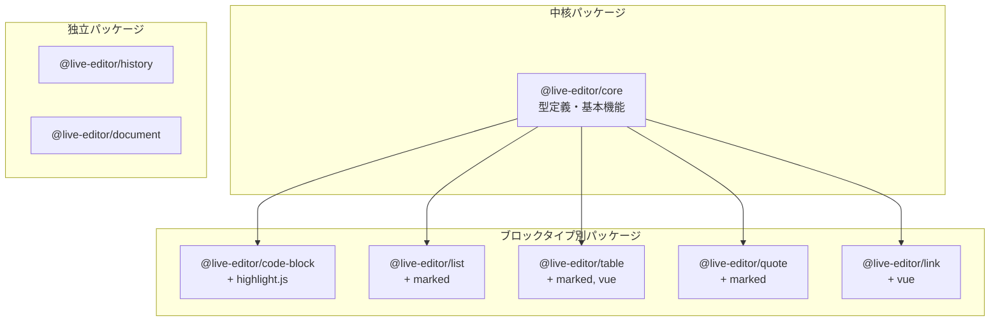

# @live-editor パッケージ一覧

Live Editorを構成するモノレポパッケージの一覧です。

## パッケージ構成

```
packages/
├── core/        # 型定義・基本機能（中核）
├── code-block/  # コードブロック
├── list/        # リスト・チェックリスト
├── table/       # テーブル
├── quote/       # 引用
├── link/        # リンクプレビュー
├── history/     # Undo/Redo
└── document/    # ドキュメント操作
```

## パッケージ一覧

| パッケージ                                        | 説明                                                   | 依存先 |
| ------------------------------------------------- | ------------------------------------------------------ | ------ |
| [@live-editor/core](./core/README.md)             | 型定義、ブロック解析、エディター機能、レンダリング基盤 | -      |
| [@live-editor/code-block](./code-block/README.md) | コードブロックの構文ハイライト・レンダリング           | core   |
| [@live-editor/list](./list/README.md)             | 箇条書き・番号付き・チェックリストのレンダリング       | core   |
| [@live-editor/table](./table/README.md)           | テーブル生成・レンダリング、`/table`コマンド           | core   |
| [@live-editor/quote](./quote/README.md)           | 引用ブロックのレンダリング                             | core   |
| [@live-editor/link](./link/README.md)             | リンクプレビュー（OGP）機能                            | core   |
| [@live-editor/history](./history/README.md)       | Undo/Redo履歴管理                                      | -      |
| [@live-editor/document](./document/README.md)     | ドキュメント操作・クリップボードコピー                 | -      |

## 依存関係図



## 機能別インポート例

### 基本機能（必須）

```typescript
import {
  useMarkdownBlocks,
  useBlockEditor,
  useKeyboardHandler,
  useFormatToolbar,
  useMarkdownRenderer,
  type Block,
  type BlockType,
  type CommandHandler,
} from '@live-editor/core';
```

### ブロックタイプ別レンダラー

```typescript
// コードブロック
import { useHighlight, useCodeBlockRenderer } from '@live-editor/code-block';

// リスト・チェックリスト
import { useChecklistRenderer, useListRenderer } from '@live-editor/list';

// テーブル
import { useTableGenerator, useTableCommand, useTableRenderer } from '@live-editor/table';

// 引用
import { useQuoteRenderer } from '@live-editor/quote';

// リンクプレビュー
import { useLinkPreview, useLinkPreviewRenderer } from '@live-editor/link';
```

### ユーティリティ

```typescript
// 履歴管理
import { useEditorHistory } from '@live-editor/history';

// ドキュメント操作
import { useMarkdownDocument } from '@live-editor/document';
```

## 開発コマンド

| コマンド           | 説明                       |
| ------------------ | -------------------------- |
| `pnpm -r build`    | 全パッケージをビルド       |
| `pnpm -r test:run` | 全パッケージのテストを実行 |
| `pnpm -r lint`     | 全パッケージのLintを実行   |

## 新しいパッケージの追加

1. `packages/` 配下にディレクトリを作成
2. `package.json`, `tsconfig.json`, `vite.config.ts` を設定
3. `src/index.ts` にエクスポートを定義
4. 必要に応じて `@live-editor/core` を依存に追加
5. `README.md` を作成

## ライセンス

MIT
